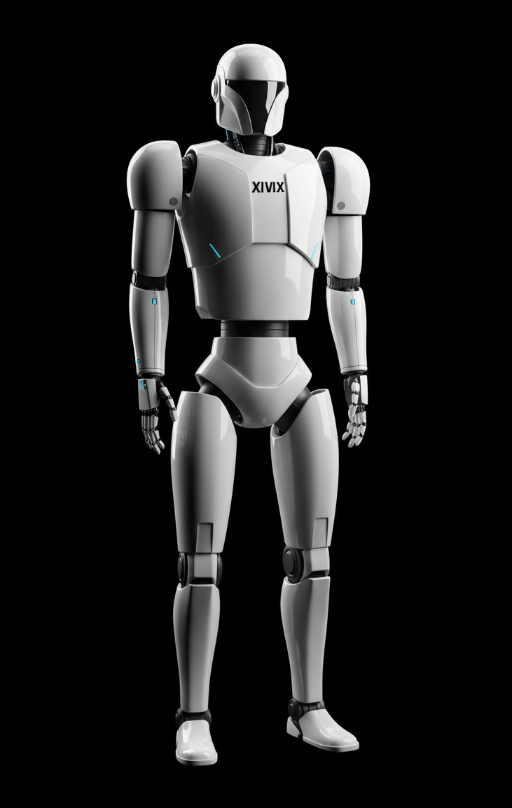

# XIVIX Robot - Physical Activity Monitoring

## Overview

The **XIVIX Robot** is an advanced physical activity monitoring system developed by XIVIX. This robot leverages AI-powered pose estimation to detect physical activities such as push-ups, squats, and other exercises, providing real-time rep counting and posture feedback to users.

## Project Vision

The XIVIX Robot aims to revolutionize fitness training and rehabilitation by providing autonomous, real-time physical activity analysis. By combining robotics, computer vision, and machine learning, this project creates an intelligent fitness companion capable of monitoring, analyzing, and guiding users through their exercise routines with precision and accuracy.

## Features

- **Activity Detection**: Identifies various physical exercises using computer vision and pose estimation
- **Rep Counting**: Automatically counts repetitions for detected exercises
- **Posture Feedback**: Provides real-time feedback on exercise form and posture
- **Multi-modal Sensor Integration**: Combines visual data with additional sensor inputs for comprehensive monitoring
- **AI-Powered Analysis**: Uses deep learning models for accurate pose and activity recognition
- **Simulation Environment**: Full robot simulation in Webots for testing and development

## Technology Stack

- **CAD Design**: FreeCAD for robot model design and iterations
- **Simulation**: Webots for physics-based robot simulation and testing
- **Computer Vision**: OpenCV, MediaPipe for pose estimation
- **Machine Learning**: TensorFlow/PyTorch for activity classification
- **Programming**: Python, ROS (Robot Operating System)
- **Version Control**: Git and GitHub

## Getting Started

### Prerequisites

- Python 3.9+
- FreeCAD 0.21+
- Webots 2023a+
- ROS 2 (optional, for advanced robotics features)

## Development Roadmap

- [ ] Phase 1: Core pose estimation implementation
- [ ] Phase 2: Activity classification model training
- [ ] Phase 3: Real-time feedback system
- [ ] Phase 4: Robot hardware integration
- [ ] Phase 5: Multi-user tracking and gym deployment
- [ ] Phase 6: Advanced metrics and analytics dashboard

## License

This project is licensed under the MIT License - see the [LICENSE](LICENSE) file for details.

## Contact & Support

For questions, feedback, or support, please reach out to the XIVIX research division:

- **Email**: info@codexustechnologies.com
- **GitHub Issues**: [Report a bug or request a feature](https://github.com/XIVIX-Official/physical-activity-monitoring-robot/issues)
- **Discussions**: [Join our community discussions](https://github.com/XIVIX-Official/physical-activity-monitoring-robot/discussions)

---

**Powered by XIVIX**
